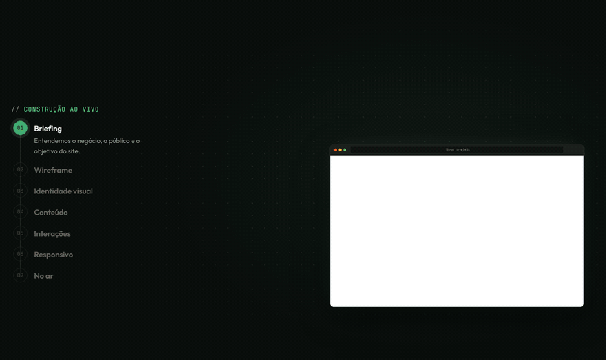
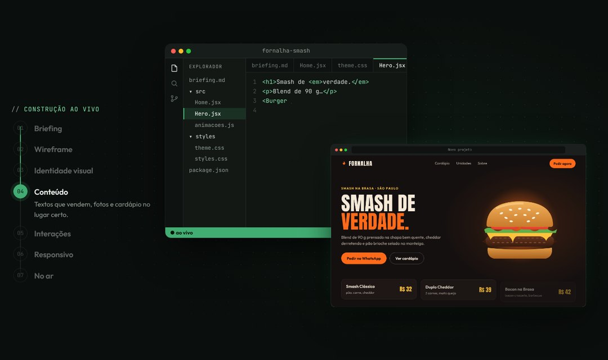
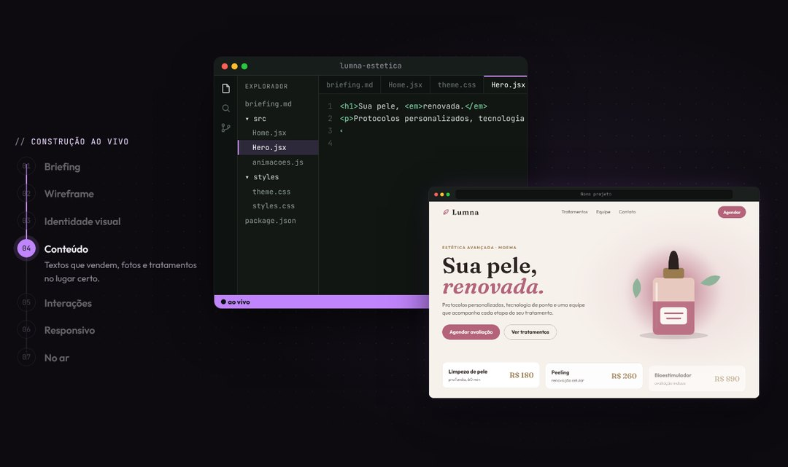

# Site Nascendo

[English](README.md) · **Português**



Seção em React que mostra um site sendo construído conforme a pessoa rola a página, do briefing até o site no ar. Rolar para baixo constrói, rolar para cima rebobina.

**[Ver demo →](https://nicolliborges.github.io/site-nascendo/)**

Feito pela [Kodra](https://kodratecnologia.com.br).

## O que a animação mostra

São 7 etapas:

1. **Briefing:** post-its com as informações do negócio voam para dentro da tela.
2. **Wireframe:** aparece a grade e blocos cinza desenham o layout.
3. **Identidade visual:** a paleta de cores e a fonte do título entram voando.
4. **Conteúdo:** o site de verdade aparece: título, texto, imagem e cards.
5. **Interações:** um cursor clica no botão principal (com faíscas) e passa por um card.
6. **Responsivo:** o notebook vira celular e o layout se adapta de verdade.
7. **No ar:** o domínio é digitado, o cadeado aparece, o medidor de velocidade enche e chega uma notificação de pedido.

Ao lado, um editor de código "digita" os arquivos de cada etapa. Eles são gerados a partir da sua config.

## Destaques

- **Um objeto de config só.** Troque textos, cores, fontes, cards e a notificação final sem mexer na animação.
- **Controlado pela rolagem** (GSAP ScrollTrigger com `pin` + `scrub`), então volta suave quando a pessoa rola para cima.
- **Responsivo de verdade.** O mini-site dentro do aparelho usa container queries e se reorganiza quando o aparelho vira celular.
- **Arte própria.** Use o hambúrguer padrão, qualquer imagem ou um SVG seu com camadas que caem uma por uma.
- **Funciona no desktop e no celular**, com um layout para cada (`gsap.matchMedia`).
- **CSS isolado.** Toda classe começa com `sn-`, então não briga com o CSS do seu site.
- **Poucas dependências:** `react`, `gsap` e `@gsap/react`.

| Hamburgueria (padrão) | Clínica de estética (config própria) |
|---|---|
|  |  |

## Rodar a demo

```bash
npm install
npm run dev
```

No topo da página dá pra trocar entre os dois exemplos.

## Usar no seu projeto

1. Copie a pasta `src/SiteNascendo/` para o seu projeto.
2. Instale as dependências:
   ```bash
   npm i gsap @gsap/react
   ```
3. Use:
   ```jsx
   import SiteNascendo from './SiteNascendo';
   import minhaConfig from './minhaConfig';

   <SiteNascendo config={minhaConfig} />
   ```
4. Carregue as fontes que você usar. A demo usa o [Fontsource](https://fontsource.org); veja `src/main.jsx`.

> Defina a config **fora** do componente (num arquivo ou numa constante). Se você criar o objeto dentro do render, a animação é recriada toda vez que a página renderiza.

O jeito mais rápido de começar é copiar `src/exemplos/clinica.jsx` e trocar os textos.

### Props

| Prop | Padrão | Para que serve |
|---|---|---|
| `config` | `{}` | Suas configurações. São mescladas por cima da config padrão (a hamburgueria). |
| `id` | `'construcao'` | O `id` da seção, útil para links âncora. |
| `className` | `''` | Classe extra na seção. |

## Config

Você só precisa passar o que quiser mudar.

```js
{
  rotulo: 'Construção ao vivo',  // texto acima das etapas
  assinatura: 'Kodra',           // rodapé do editor de código
  duracao: 6.2,                  // quantas telas de rolagem a animação dura

  // cores e fontes da seção em volta (pensado para fundo escuro)
  tema: { fundo, texto, apagado, destaque, destaque2, fonte, fonteMono },

  etapas: [{ titulo, texto }, ...],    // sempre 7. Use {} para manter uma etapa como está
  briefing: [{ rotulo, valor }, ...],  // os post-its (máximo 4)

  site: {                        // o site que aparece sendo construído
    nome, dominio, logo,
    icone,                       // 'chama' | null | <svg/>
    menu: ['...', '...'], botaoMenu,
    tag, titulo, tituloDestaque, texto,
    botao, botaoSecundario,
    cards: [{ titulo, texto, preco }],   // de 1 a 3 fica melhor
    arte,                        // 'burger' | 'imagem.png' | <svg> com camadas
    fonteTitulo, pesoTitulo, tituloMaiusculo, tamanhoTitulo, destaqueItalico,
    cores: { fundo, texto, primaria, textoNaPrimaria, acento, card, linha },
    paleta: null,                // bolinhas de cor. null = usa as cores acima
  },

  editor: { secao, itens, arte },  // nomes que aparecem no código de mentira

  final: {
    publicado, velocidade, rotuloVelocidade, visitante,
    notificacao: { app, titulo, texto },
  },
}
```

Todos os valores padrão estão em `src/SiteNascendo/config.js`.

### Arte própria

- **Imagem:** `arte: '/minha-foto.png'`. Ela entra caindo inteira.
- **SVG em camadas** (como o hambúrguer): coloque `className="sn-camada"` em cada `<g>`, de baixo para cima, e cada camada cai separada. Veja `src/exemplos/clinica.jsx`.

## Como funciona

- A seção fica presa na tela com o ScrollTrigger (`pin: true`, `scrub: 0.8`). Uma única timeline do GSAP, de uns 13 "segundos", é distribuída ao longo de `duracao × altura da tela` de rolagem.
- Cada etapa começa num tempo fixo da timeline (`TEMPOS` em `SiteNascendo.jsx`). Uma função no ticker marca a etapa, a aba e o arquivo ativos.
- **Efeito de digitação:** cada linha de código usa `clip-path: inset(0 calc(100% - var(--n) * 1ch) 0 -2px)`, e o GSAP anima `--n` de 0 até o tamanho da linha. Como a fonte é monoespaçada, aparece uma letra de cada vez.
- **Notebook → celular:** o GSAP anima um valor `morph` de 0 a 1, e largura, altura, borda e escala são calculadas a partir dele. A variável CSS `--m` esconde as bolinhas do navegador e mostra o notch.
- **Mini-site responsivo:** a tela do aparelho é um container CSS (`container: sn-vp / inline-size`). Por isso o mini-site muda para o layout de celular por container query, não por media query.

## Dicas

- **Títulos curtos:** 2 ou 3 palavras + o destaque. O mini-site é pequeno.
- **Rolagem suave é opcional.** A demo usa o [Lenis](https://github.com/darkroomengineering/lenis); veja o `useLenis()` em `src/App.jsx`.
- **Publicar:** a GitHub Action incluída publica a demo no GitHub Pages a cada push na `main`. Ative uma vez em *Settings → Pages → Source: GitHub Actions*.
- **Mexer mais fundo:** para mudar a estrutura do mini-site, abra `MiniSite.jsx`. Mantenha as classes `sn-cta`, `sn-card` e `sn-art`, porque a animação procura por elas.

## Licença

[MIT](LICENSE) © Kodra. Feito com [React](https://react.dev), [GSAP](https://gsap.com) e [Lenis](https://github.com/darkroomengineering/lenis).

Precisa de um site, sistema ou automação? Fale com a [Kodra](https://kodratecnologia.com.br).
